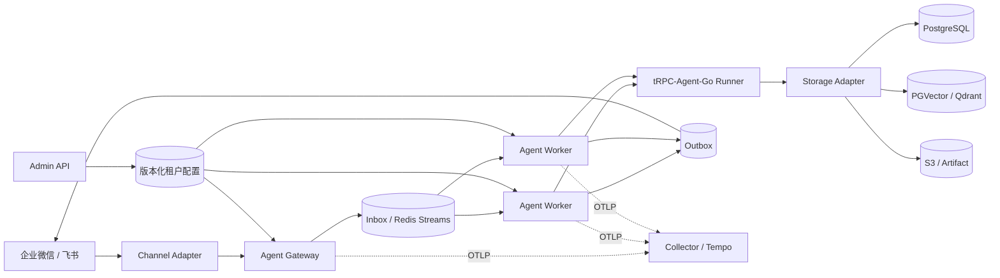

# tRPC-Agent Service

[](https://github.com/Skylm808/trpc-agent-service/actions/workflows/ci.yml)

基于 tRPC-Agent-Go 的多租户、节点化 Agent 服务。项目已实现企业微信与飞书接入、Gateway/Worker 水平扩展、共享会话与记忆、多后端迁移、租户治理、审计及可观测性。

## 一键 Demo

只需 Go 1.24+，无需 Docker、外部模型、IM 凭据或数据库：

```bash
git clone https://github.com/Skylm808/trpc-agent-service.git
cd trpc-agent-service
./demo.sh
```

Demo 使用确定性的 Mock Model 和内存后端，不访问公网，也不会打印消息正文或凭据。它会验证：

- 两租户、两 Worker 的路由和共享状态；
- Gateway/Worker 角色隔离及无 sticky session；
- 企业微信、飞书的验签、加密回调、幂等和租户隔离；
- ACL 拒绝、Session/Memory 指标与安全输出。

成功时最后一行是：

```text
PASS offline evaluator demo completed
```

也可以只运行最小 Agent 示例：

```bash
go run ./examples/quickstart ./configs/demo.yaml
```

## 架构概览



Gateway 只接收和规范化请求，Worker 执行 Runner；节点不保存会话亲和状态。租户、binding、identity、session 和 message_id 共同确定隔离边界，共享 PostgreSQL/Redis 保证任意 Worker 可继续处理，因此不需要 sticky session。

## 当前能力

| 范围 | 已实现 |
| --- | --- |
| 多租户 | 版本化租户/应用配置，模型、工具、IM、后端、审计策略按租户解析；数据键和查询强制带 `tenant_id` |
| 多节点 | Gateway/Worker/all 三种角色；Redis Streams 调度；Inbox lease、fencing token、`runner/derived/outbox` 可恢复阶段、崩溃接管、优雅 drain |
| IM | 企业微信和飞书文本链路、回调验签/解密、去重、身份映射、媒体受控下载、基础文本文件提取、飞书卡片回复 |
| Agent 编排 | 单 LLMAgent，以及 Chain、Parallel + Aggregator、有限 Cycle、声明式 Graph；均按租户配置版本构建不可变 Runtime Bundle |
| 治理安全 | 用户/群 ACL、工具白名单、token/版本化成本预算、并发配额、Gateway 跨节点限流、危险工具确认、租户级 Audit fail-closed、env/file/Vault/KMS SecretRef、Runner Plugin 脱敏 |
| 数据 | Session、Event、Memory、Summary、Artifact、Knowledge、Audit 的统一租户路由；迁移 checkpoint、checksum、双写与 cutover |
| 可观测性 | Prometheus 指标、OTLP Trace、Tempo、Grafana，以及错误率、DLQ、积压、无 Worker、数据库异常告警 |
| 部署运维 | 单机 Compose、多 Worker Compose、最小 Kubernetes Demo；探针、PDB、HPA、滚动升级和回滚验收 |

企业微信与飞书协议自动化验收已纳入 CI；真实平台 E2E 需要部署方提供账号、公网 HTTPS 回调并按[生产验收说明](docs/production-acceptance.md)留存脱敏证据，仓库不保存截图、用户消息正文或真实凭据。

## Compose 运行

生产型 Compose 需要自行提供模型和基础设施配置：

```bash
cp .env.example .env
# 在本地填写所需 SecretRef 对应的环境变量，不要提交 .env
docker compose up -d --build
curl -fsS http://127.0.0.1:8080/healthz
curl -fsS http://127.0.0.1:8080/readyz
```

验证一个 Gateway 与两个 Worker：

```bash
docker compose --profile multinode up -d --build gateway worker-a worker-b
./scripts/multinode_acceptance.sh
```

Compose 使用命名数据卷保存 PostgreSQL、Redis、Tempo 和 Grafana 数据。停止单个节点不会重新初始化数据；不要运行 `docker compose down -v` 或删除数据卷。

常用验收入口：

```bash
./scripts/dual_im_contract_acceptance.sh
./scripts/coverage_acceptance.sh
./scripts/observability_acceptance.sh
./scripts/kubernetes_acceptance.sh
```

Kubernetes 脚本会创建本地 kind 集群并走通部署、扩缩容、Pod 故障、滚动升级、HPA/PDB 和回滚；它是可复现的最小验收 Demo，不宣称替代真实生产集群容量测试。

## 数据后端

| 数据域 | 可选后端 | 默认生产选择 |
| --- | --- | --- |
| Runner Session / Summary | InMemory（仅离线）、PostgreSQL、Redis | PostgreSQL |
| 平台 Event / state / fencing | PostgreSQL | PostgreSQL |
| Memory | InMemory（仅离线）、PostgreSQL、外部 Memory Service | PostgreSQL |
| Knowledge | InMemory、PGVector、Qdrant | PGVector |
| Artifact | InMemory、PostgreSQL、S3 | PostgreSQL |
| Audit | InMemory（仅离线）、PostgreSQL；可同步至外置 WORM Archive | PostgreSQL + 归档 |

InMemory 只用于测试和离线 Demo；生产模式会拒绝关键数据域使用内存后端。Redis Runner Session 必须配置独立 `namespace`，平台事件顺序、fencing、Inbox 和 Outbox 仍由 PostgreSQL 强一致保存。Runner Session/State/Event/Track/Summary 已支持 Redis ↔ PostgreSQL 分批迁移；迁移由 Admin API 创建、推进并 cutover，checkpoint、checksum、配置版本及租户边界都持久化在 PostgreSQL。

平台提交链按稳定 Inbox ID 恢复：Runner 结果、派生写和 Outbox 分别记录 durable stage，节点接管后从最近阶段继续，不重复已保存的模型结果。必须注意，模型或工具已经执行、但进程在保存 Runner 结果前崩溃时仍属于 at-least-once 边界；因此生产 MCP 只允许声明为幂等的服务，带副作用的 HTTPS 业务工具会传递稳定 `X-Idempotency-Key`。详见[数据同步与幂等](docs/message-runtime.md)。

## Admin API

Admin API 是平台控制面，用于租户配置的预览、发布、回滚，以及存储迁移、节点和队列状态管理；它不承载 IM 消息处理。写操作需要管理令牌并带审计记录，接口说明见[部署指南](docs/deployment.md#配置发布)。

## 文档

- [架构设计](docs/architecture.md)：组件职责、路由、隔离、一致性与容量设计
- [需求验收矩阵](docs/acceptance-matrix.md)：题目要求对应的代码、测试与验收证据
- [双 IM 可复现验收](scripts/dual_im_contract_acceptance.sh)：合成加密回调到模拟平台回复
- [容量测试与估算](docs/capacity.md)：负载探针、容量模型与准入指标
- [部署指南](docs/deployment.md)：Compose、生产参数和运维操作
- [数据模型](docs/data-model.md)：核心表和租户键
- [数据同步与幂等](docs/message-runtime.md)：顺序、幂等、lease 与 fencing
- [多后端与迁移](docs/storage-migrations.md)：适配、双写、校验和 cutover
- [企业微信接入](docs/wecom.md) / [飞书接入](docs/feishu.md)
- [治理与安全](docs/governance.md) / [可观测性](docs/observability.md)
- [风险清单](docs/risks.md)：生产风险与缓解措施
- [Kubernetes Demo](deploy/kubernetes/README.md)

## 开发验证

```bash
./demo.sh
GOCACHE=/private/tmp/trpc-agent-service-cache ./check.sh
go test ./trpcservice/channels/... ./trpcservice/acceptance/...
go test ./trpcservice/storage/... ./trpcservice/storagemigration/...
```

涉及真实企业微信、飞书、模型、数据库或对象存储的测试必须显式提供环境变量；默认测试不会读取真实凭据。仓库禁止提交 `.env`、`configs/local.yaml`、Secret、下载 URL、媒体 key 或用户消息正文。

生产入口默认限制每个 `(tenant_id, binding_id)` 每秒 100 个回调，可用 `TRPC_AGENT_GATEWAY_RATE_LIMIT` 调整。Vault/KMS-compatible HTTPS Secret Provider 的 bootstrap 参数及其他生产环境变量见 [`.env.example`](.env.example) 和[部署指南](docs/deployment.md)。

## 许可证

本项目采用 [Apache License 2.0](LICENSE)。
