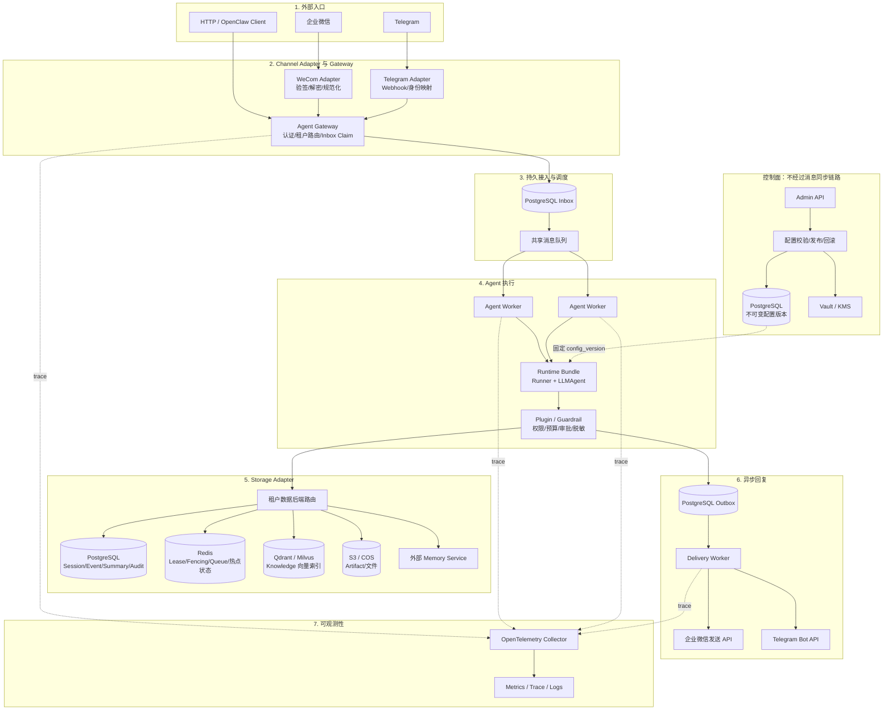
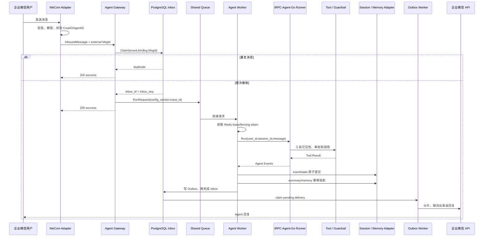

# 多租户节点化 Agent 平台架构设计

## 1. 目标与边界

这个平台解决的是 Agent 从单进程示例走向企业服务后的几个实际问题：同一套集群要承载多个租户；用户可能从企业微信、Telegram 或 HTTP 入口发消息；Worker 可以随时扩缩容；会话、记忆、知识库和审计数据不能串租户；节点重启、IM 重投和配置发布不能造成重复执行或状态倒退。

平台以 tRPC-Agent-Go 为执行内核，复用 `runner.Runner`、LLMAgent、Tool、Session、Memory、Artifact、Knowledge、Plugin 和 OpenTelemetry 接口。租户管理、消息幂等、节点调度、fencing、配置版本、后端路由、IM 账号绑定、审计与成本治理由平台层实现。

Session、Inbox、Outbox、配置和审计通过共享存储协作；Redis、PostgreSQL、向量库和对象存储由各自 Adapter 接入。

## 2. 系统拓扑

系统分成控制面和数据面。控制面负责租户配置的发布与回滚，不进入每条消息的同步调用；数据面接收消息并运行 Agent。两者共享 PostgreSQL 中的不可变配置版本，Worker 执行一次请求时固定使用消息入站时记录的 `config_version`。

Agent Gateway 和 Worker 都是无状态节点，不要求负载均衡器提供 sticky session。Gateway 只根据已认证的 `channel_binding` 得到 `tenant_id`、`app_id` 和配置版本，再生成 canonical user/session。实际状态保存在共享后端；任何 Worker 取得队列消息和 session lease 后都能继续执行。

## 3. 租户、配置与隔离

`tenant_id` 是最高隔离边界。一个租户可以有多个 Agent App，每个 App 保存模型配置、系统指令、工具策略、IM 绑定、存储路由和审计策略。配置发布后不可修改；`config_versions` 保存完整的 canonical 配置和内容摘要，`tenants.current_config_version` 是发布头。并发发布使用 expected version 做 CAS，回滚会创建一个新版本，而不是覆盖旧记录。

隔离规则落实在接口和数据模型中：Repository 的每个方法都显式接收 `tenant_id`；SQL 的主键、唯一键、外键和索引以租户字段开头；Runtime Bundle 的键是 `(tenant_id, app_id, config_version)`；工具在展示和执行两个阶段都经过租户策略；模型密钥、IM token 和数据库凭据只保存 `SecretRef`，运行时从 Vault、KMS 或挂载文件解析。日志与 trace 禁止记录 secret value，消息内容是否进入审计由租户的 `AuditPolicy` 决定。

用户身份也不能直接采用 IM 平台给出的裸 ID。单聊用户映射为 `{channel}/{binding_id}/{external_user_id}`；群聊 session 使用 `group/{binding_id}/{conversation_id}`；单聊使用 `dm/{binding_id}/{external_user_id}`。同一人在不同群、不同绑定或不同租户中得到不同作用域，不能借助客户端提交的 `session_id` 越界读取。

## 4. 消息执行链路

`trace_id` 在回调时生成或从可信上游提取，随后写入 Inbox、RunRequest、Runner context、Tool span、Session/Memory 写入、Outbox 和审计日志。`request_id` 使用租户作用域的 Inbox ID。这样一次 IM 回调即使跨过 Gateway、队列、Worker 和发送节点，仍能在 trace 中还原。

同一 session 的并发写由 Redis fencing token 和 PostgreSQL session head 共同约束。Worker 取得 lease 后先推进 `last_fence`；提交时必须在同一事务中检查 token，并要求 `inbox_seq = last_event_seq + 1`。暂停后恢复的旧 Worker 即使继续运行，也会因 fence 过期而无法写入。

提交顺序固定为：`message event + state` 原子提交，随后更新 Summary/Memory，接着创建 Outbox，最后把 Inbox 标记为 completed。Summary 使用 `(version, cutoff_event_seq)` CAS；Memory 以 source event 做幂等；Outbox 以 `(tenant_id, dedupe_key)` 去重。中间失败保留可重试状态，重跑不会多写 event、memory 或 IM 回复。详细约束见 [多节点消息运行时](message-runtime.md) 和 [数据模型](data-model.md)。

## 5. 多后端适配

平台使用按数据域拆分的 Adapter，不设计一个包办所有后端的通用 KV 接口。Session 需要顺序和事务，Knowledge 需要向量召回，Artifact 需要大对象读写；强行统一会丢失各后端真正需要的语义。

| 数据域 | 生产后端 | 存储内容 | 一致性与取舍 |
| --- | --- | --- | --- |
| Tenant / Config / Channel Binding | PostgreSQL | 租户、App、不可变配置版本、IM 绑定 | 强一致；发布频率低，适合事务和审计 |
| Inbox / Session / Event / Summary / Audit | PostgreSQL | 幂等消息、会话头、事件流、摘要、审计 | 事务强一致；热点 session 可能产生行锁竞争 |
| Lease / Fencing / Queue / 热点缓存 | Redis Cluster | Worker 所有权、单调 token、短期状态、命令与事件总线 | 低延迟；不能把易失缓存当作事实来源，需 AOF/集群和降级策略 |
| Memory | PostgreSQL 或外部 Memory 服务 | 用户长期事实、source event、版本状态 | SQL 便于强隔离；外部服务通常最终一致，读取要接受短暂不可见 |
| Knowledge | Qdrant / Milvus | embedding、chunk metadata、索引版本 | 最终一致；源文档版本保存在 SQL，检索结果必须带 tenant filter |
| Artifact | S3 / COS | 图片、文件、工具产物 | 对象本体成本低；元数据和权限保存在 SQL，使用短时签名 URL |

Session 的事实来源选择 PostgreSQL，Redis 负责 lease、fencing 和热点加速。这样 Redis 故障不会让历史事件消失，代价是一次 turn 至少包含 Inbox 和 Session 事务。Knowledge 与 Artifact 不进入主事务：event 提交后创建派生任务，异步更新向量索引或对象元数据。Agent 可以在短时间内读到旧知识版本，但不能读到其他租户的数据。

后端迁移采用 `snapshot -> dual write -> catch-up -> verify -> cutover -> rollback window`。迁移任务按租户、App 和数据域维护 checkpoint。以 Redis Session 迁往 PostgreSQL 为例，先记录源端水位并做快照，再把新写入同时写到两端；追平后比较 event 数、末序号和抽样状态，最后原子更新租户配置版本。向量库迁移以稳定 chunk ID 重建索引，切换前对相同查询做召回抽检。旧后端在回滚窗口内只读保留，不允许切换当天立即删除。

## 6. 治理、可观测性与故障处理

Worker 在 Runner 之前执行身份和预算预检，在 Tool 展示与执行时再次应用白名单、危险工具审批和权限校验，最终回复经过脱敏后才能写 Outbox。审计记录 tenant、channel、user、session、agent、tool、decision、latency、error type、cost 和 trace ID。审计后端超时时，当前策略是业务 fail-open、产生告警；涉及强监管的租户可以配置为 fail-closed，但必须单独评估可用性影响。

节点收到取消或超时时调用 `ManagedRunner.Cancel(request_id)`，然后在有界时间内排空事件 channel。Tool 必须接受 `context.Context`，外部副作用使用业务幂等键，不能靠 goroutine 脱离请求继续执行。模型超时、数据库短暂不可用和 Outbox 投递失败进入分类重试；不可重试错误写入 DLQ，并保留原始 request/trace 关联。

配置灰度以租户或 App 为单位。新版本发布后，新消息固定进入新 Bundle，旧请求继续持有旧 Bundle lease，直到执行结束才关闭。回滚仍发布新配置版本。容量评估以四组数据为准：IM 回调峰值、每节点活跃 Runner 数、平均/高分位 token 与工具耗时、PostgreSQL/Redis/向量库 QPS。扩容信号优先看队列等待时间和 Outbox backlog，而不是只看 CPU。

生产风险及缓解措施见 [生产风险清单](risks.md)。

## 7. 部署方案

最小可运行环境使用根目录的 Docker Compose：一个 Gateway/Worker 合并进程、PostgreSQL、Redis 和一次性 migration。企业微信通过公网反向代理进入 Adapter；模型、IM 和数据库密钥从挂载的 secret 文件读取。这个形态用来做协议联调和故障回放，不承诺单点容灾。启动与验证命令见 [PostgreSQL + Redis 部署](deployment.md)。

生产环境使用 Kubernetes：Gateway、Worker、Channel Adapter、Outbox Worker 和 Admin API 分别部署，按队列等待、活跃 Runner 和投递积压独立扩容；PostgreSQL、Redis、对象存储和向量库使用托管或高可用集群。Pod 不挂载会话本地盘，也不依赖 sticky session。配置发布先进入少量租户，指标越过阈值即停止灰度并发布回滚版本。数据库迁移由独立 Job 串行执行，不能放在每个应用 Pod 启动流程中并发运行。

## 8. 框架复用与平台新增

| 能力 | 直接复用 tRPC-Agent-Go | 平台负责 |
| --- | --- | --- |
| Agent 执行 | Runner、LLMAgent、Event stream、Tool/MCP | Runtime Bundle、版本固定、节点调度和取消转发 |
| 状态能力 | Session、Memory、Artifact、Knowledge 接口 | 租户后端路由、fencing、迁移任务和数据隔离 |
| 治理 | Plugin、Guardrail、Tool Filter/Permission | 租户策略、预算账本、审批存储和审计规则 |
| 服务协议 | OpenClaw 与服务化接口 | IM 验签、账号绑定、Inbox/Outbox 和身份映射 |
| 可观测性 | OpenTelemetry hook | 跨节点传播、低基数指标、租户成本和日志脱敏 |

当前仓库已经实现配置版本、控制面数据模型、Runtime Bundle、PostgreSQL + Redis 组合器、Inbox/fencing/Outbox、Inbox 崩溃恢复与 DLQ、治理审计、OpenTelemetry 链路、Compose 最小部署和企业微信 Adapter。Gateway 到 Worker 的即时快速路径仍是进程内 dispatcher，但丢失的任务可由任一节点从 PostgreSQL 恢复。Telegram Adapter、Outbox 消费进程、共享预算/审批/状态及 Kubernetes manifest 仍需后续 PR 完成。`skill`、`web`、`workspace` 目录目前不是已交付能力，不纳入本设计的完成项。
